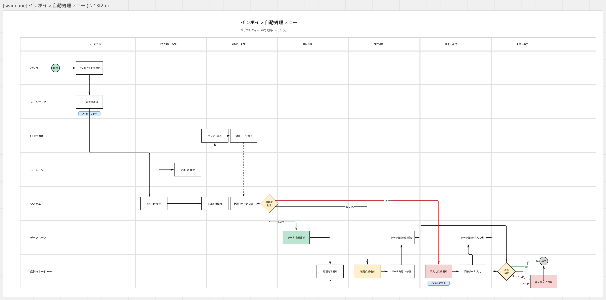
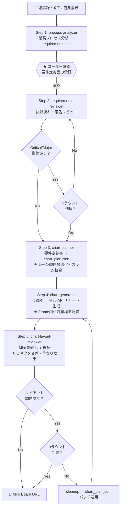

# Swimlane Chart Pipeline for Miro

お客様ヒアリング情報（議事録・メモ・業務シナリオ）から、Miro 上のスイムレーンチャートを自動生成するパイプライン。Claude Code の Skill / Agent として実装し、`/swimlane-pipeline` コマンド一つで全工程を実行可能。

## 生成サンプル

以下は議事録テキストから自動生成されたインボイス自動処理フローの例（7レーン・7カラム・23ノード・23コネクタ・3分岐判定）。



## パイプライン全体像



## ステータス

**全5フェーズ実装完了・E2Eテスト済み**

E2E テスト実績: インボイス自動処理フロー（7レーン・7カラム・23ノード・23コネクタ・3分岐判定）

## セットアップ

### 前提条件

- Python 3.12+
- Miro アカウント（Free プラン以上）

### インストール

```bash
python3.12 -m venv .venv
source .venv/bin/activate
pip install -r requirements.txt
```

### Miro API トークンの取得

1. [Miro Developer Platform](https://miro.com/app/settings/user-profile/apps) でアプリを作成
2. スコープに `boards:read` と `boards:write` を設定
3. アプリをインストールしてアクセストークンを取得

詳細は [docs/setup-guide.md](docs/setup-guide.md) を参照。

### 環境変数の設定

`.env.example` をコピーして `.env` を作成し、値を設定する:

```bash
cp .env.example .env
```

ボード ID はボード URL の `https://miro.com/app/board/<BOARD_ID>/` から取得する。

## 使い方

### パイプラインコマンド（Claude Code 上で実行）

```
/swimlane-pipeline
```

議事録テキストを入力すると、要件分析 → レビュー → JSON 生成 → Miro チャート生成 → 視覚レビューまで自動実行される。

### JSON からチャート生成

```bash
python scripts/generate_chart.py <chart_plan.json> [--run-id <uuid>]
```

### チャートの検証（重複・ラベル切れ・コネクタ欠損・フレームはみ出し）

```bash
python scripts/validate_chart.py <output/run_id/miro_items.json> [--chart-plan <json>]
```

### 生成済みチャートの削除

```bash
python scripts/cleanup_chart.py <output/run_id/miro_items.json> [--force]
```

### デモスクリプト

```bash
python scripts/swimlane_chart_demo.py
```

## プロジェクト構造

```
swimlane-chart/
├── .claude/
│   ├── skills/                    ← Skill 定義
│   │   ├── swimlane-pipeline/     全ステップ統合実行
│   │   ├── process-analyzer/      業務プロセス分析
│   │   ├── requirements-reviewer/ 要件レビューループ
│   │   ├── chart-planner/         要件 → JSON 構造化
│   │   │   ├── references/
│   │   │   │   ├── layout_heuristics.md  レーン順序・カラム統合ルール
│   │   │   │   ├── node_kind_guide.md    ノード種別・サイズガイド
│   │   │   │   └── color_palette.md      カラーパレット
│   │   │   └── assets/
│   │   │       └── chart_plan_schema.json  JSONスキーマ
│   │   └── chart-generator/       JSON → Miro API
│   │       └── references/
│   │           └── miro_api_constraints.md  API制約事項
│   └── agents/                    ← Agent 定義
│       ├── process-analyst.md         テキスト分析
│       ├── process-consultant.md      要件レビュー
│       └── chart-layout-reviewer.md   視覚品質レビュー
├── src/                           ← コアライブラリ
│   ├── swimlane_lib.py            座標計算・API クライアント
│   └── chart_plan_loader.py       JSON → dataclass 変換・パッチ適用
├── scripts/                       ← CLI ツール
│   ├── generate_chart.py          JSON → Miro チャート生成
│   ├── cleanup_chart.py           生成済みアイテム一括削除
│   ├── validate_chart.py          Miro API 読戻し＋検証
│   └── swimlane_chart_demo.py     ハードコードされたデモスクリプト
├── tests/                         ← テストスイート
│   ├── conftest.py                共通フィクスチャ
│   ├── test_generate_chart.py     Frame内配置・parent注入テスト
│   ├── test_cleanup_chart.py      非TTY環境安全性テスト
│   ├── test_validate_chart.py     検証ロジックテスト
│   ├── test_chart_plan_loader.py  JSONパッチ・バリデーションテスト
│   ├── test_chart_plan_schema.py  スキーマ同期テスト
│   ├── test_swimlane_lib.py       コアライブラリテスト
│   └── test_swimlane_chart.py     デモスクリプトテスト
├── examples/                      ← サンプルデータ
│   └── monthly_report_flow.json
├── output/                        ← 実行時生成物（.gitignore 対象）
│   └── {run_id}/
│       ├── requirements.md        要件定義書
│       ├── chart_plan.json        チャート計画
│       ├── miro_items.json        Miro アイテム追跡情報
│       └── validation_report.json 検証レポート
├── docs/
│   ├── miro-chart-architecture.md チャートエンジン設計書
│   ├── setup-guide.md             セットアップ手順書
│   └── pipeline-design.md         パイプライン設計書
├── requirements.txt               依存パッケージ
├── .env                           環境変数（.gitignore 対象）
└── .gitignore
```

## chart_plan.json の書き方

```json
{
  "title": "月次売上報告フロー",
  "subtitle": "月次（毎月末締め、翌月5営業日目報告）",
  "lanes": ["各営業拠点", "営業企画部", "経理部"],
  "columns": ["毎月末日", "翌月1日", "翌月2日"],
  "layout": { "lane_height": 200, "col_width": 420 },
  "nodes": [
    { "key": "START", "label": "開始", "lane": "各営業拠点", "col": 0, "kind": "start" }
  ],
  "edges": [
    { "src": "START", "dst": "SF_INPUT" }
  ]
}
```

### ノード種別

| kind | Miro Shape | 用途 | デフォルトサイズ |
|---|---|---|---|
| `start` | circle | フロー開始点 | 50×50 |
| `end` | circle | フロー終了点 | 50×50 |
| `task` | rectangle | タスク / 処理 | 160×80 |
| `decision` | rhombus | 判断 / 分岐 | 110×110 |
| `chip` | round_rectangle | 使用システム名タグ | 130×28 |

### レイアウトパラメータ

| パラメータ | デフォルト | 説明 |
|---|---|---|
| `lane_height` | 200 | 各レーンの高さ |
| `col_width` | 420 | 各カラムの幅 |
| `left_label_width` | 260 | 左端のレーンラベル領域幅 |
| `task_w` | 160 | タスクノードの幅 |
| `task_h` | 80 | タスクノードの高さ |
| `decision_w` | 110 | 判定ノードの幅 |
| `decision_h` | 110 | 判定ノードの高さ |
| `chip_w` | 130 | チップノードの幅 |
| `frame_padding` | 200 | 背景ボックスの内側パディング（コンテンツ領域の左右に各100px） |

各ノードの `dx`, `dy` で同一カラム・レーン内の微調整が可能。

### レーン順序の最適化

レーン配列の並び順はコネクタ交差に直結する。以下の原則に従うこと:

- **隣接性原則**: エッジで接続されるノードが多いレーン同士を隣接させる
- **分岐近接原則**: decision の分岐先レーンを decision レーンに隣接させる
- **空レーン回避**: フロー後半で未使用のレーンがアクティブなレーン間に挟まらないようにする

## 実装ロードマップ

| Phase | 内容 | ステータス |
|---|---|---|
| 1 | 基盤整備: コアライブラリ抽出、JSON ローダー、CLI ラッパー | 完了 |
| 2 | ユーティリティ: cleanup / validate スクリプト | 完了 |
| 3 | Agent 定義: process-consultant / chart-layout-reviewer / process-analyst | 完了 |
| 4 | Skill 作成: chart-generator → chart-planner → requirements-reviewer → process-analyzer | 完了 |
| 5 | 統合: swimlane-pipeline マスターオーケストレーター + E2E テスト | 完了 |

## 制約 / 注意事項

- Bulk API は 1 回あたり最大 20 アイテム（トランザクション）
- コネクタの経路（折れ曲がり位置）は Miro が自動決定する
- レート制限: 100,000 クレジット/分（通常の利用では問題なし）
- Frame 内アイテムは `parent_top_left` 相対座標で配置される
- Frame と背景ボックスの間には上下左右に余白がある（左右: `FRAME_SIDE_MARGIN`=50px、下: 50px、上: 150px（タイトル領域））
- 削除済みアイテムへのクリーンアップは 404 を正常扱いして即完了する

## ドキュメント

- [チャートエンジン設計書](docs/miro-chart-architecture.md) - データモデル、座標計算、API 仕様の詳細
- [セットアップ手順書](docs/setup-guide.md) - Miro API の環境構築ガイド
- [パイプライン設計書](docs/pipeline-design.md) - Skill/Agent 全体設計
