# Swimlane Chart Pipeline for Miro

お客様ヒアリング情報（議事録・メモ・業務シナリオ）から、Miro 上のスイムレーンチャートを自動生成するパイプライン。Claude Code の Skill / Agent として実装し、`/swimlane-pipeline` コマンド一つで全工程を実行可能。

## パイプライン全体像

```mermaid
flowchart TD
    INPUT["📄 議事録 / メモ / 箇条書き"]
    S1["Step 1: process-analyzer<br/>業務プロセス分析 → requirements.md"]
    UC1{{"★ ユーザー確認<br/>要件定義書の承認"}}
    S2["Step 2: requirements-reviewer<br/>抜け漏れ・矛盾レビュー"]
    S2CHECK{"Critical/Major<br/>指摘あり？"}
    S2ROUND{"3ラウンド<br/>到達？"}
    S3["Step 3: chart-planner<br/>要件定義書 → chart_plan.json<br/>★ レーン順序最適化・カラム統合"]
    S4["Step 4: chart-generator<br/>JSON → Miro API チャート生成<br/>★ Frame内相対座標で配置"]
    S5["Step 5: chart-layout-reviewer<br/>Miro 読戻し + 検証<br/>★ コネクタ交差・重なり検出"]
    S5CHECK{"レイアウト<br/>問題あり？"}
    S5ROUND{"3ラウンド<br/>到達？"}
    CLEANUP["cleanup → chart_plan.json パッチ適用"]
    OUTPUT["🎯 Miro Board URL"]

    INPUT --> S1
    S1 --> UC1
    UC1 -->|承認| S2
    S2 --> S2CHECK
    S2CHECK -->|No| S3
    S2CHECK -->|Yes| S2ROUND
    S2ROUND -->|No| S2
    S2ROUND -->|Yes| S3
    S3 --> S4
    S4 --> S5
    S5 --> S5CHECK
    S5CHECK -->|No| OUTPUT
    S5CHECK -->|Yes| S5ROUND
    S5ROUND -->|No| CLEANUP
    S5ROUND -->|Yes| OUTPUT
    CLEANUP --> S4
```



## ステータス

**全5フェーズ実装完了・E2Eテスト済み**

E2E テスト実績: インボイス自動処理フロー（7レーン・7カラム・23ノード・23コネクタ・3分岐判定）

## セットアップ

### 前提条件

- Python 3.12+
- Miro アカウント（Free プラン以上）

### インストール

```bash
python3.12 -m venv .venv
source .venv/bin/activate
pip install -r requirements.txt
```

### Miro API トークンの取得

1. [Miro Developer Platform](https://miro.com/app/settings/user-profile/apps) でアプリを作成
2. スコープに `boards:read` と `boards:write` を設定
3. アプリをインストールしてアクセストークンを取得

詳細は [docs/setup-guide.md](docs/setup-guide.md) を参照。

### 環境変数の設定

`.env.example` をコピーして `.env` を作成し、値を設定する:

```bash
cp .env.example .env
```

ボード ID はボード URL の `https://miro.com/app/board/<BOARD_ID>/` から取得する。

## 使い方

### パイプラインコマンド（Claude Code 上で実行）

```
/swimlane-pipeline
```

議事録テキストを入力すると、要件分析 → レビュー → JSON 生成 → Miro チャート生成 → 視覚レビューまで自動実行される。

### JSON からチャート生成

```bash
python scripts/generate_chart.py <chart_plan.json> [--run-id <uuid>]
```

### チャートの検証

```bash
python scripts/validate_chart.py <output/run_id/miro_items.json> [--chart-plan <json>]
```

### 生成済みチャートの削除

```bash
python scripts/cleanup_chart.py <output/run_id/miro_items.json> [--force]
```

### デモスクリプト

```bash
python scripts/swimlane_chart_demo.py
```

## プロジェクト構造

```
swimlane-chart/
├── .claude/
│   ├── skills/                    ← Skill 定義
│   │   ├── swimlane-pipeline/     全ステップ統合実行
│   │   ├── process-analyzer/      業務プロセス分析
│   │   ├── requirements-reviewer/ 要件レビューループ
│   │   ├── chart-planner/         要件 → JSON 構造化
│   │   │   ├── references/
│   │   │   │   ├── layout_heuristics.md  レーン順序・カラム統合ルール
│   │   │   │   ├── node_kind_guide.md    ノード種別・サイズガイド
│   │   │   │   └── color_palette.md      カラーパレット
│   │   │   └── assets/
│   │   │       └── chart_plan_schema.json  JSONスキーマ
│   │   └── chart-generator/       JSON → Miro API
│   │       └── references/
│   │           └── miro_api_constraints.md  API制約事項
│   └── agents/                    ← Agent 定義
│       ├── process-analyst.md         テキスト分析
│       ├── process-consultant.md      要件レビュー
│       └── chart-layout-reviewer.md   視覚品質レビュー
├── src/                           ← コアライブラリ
│   ├── swimlane_lib.py            座標計算・API クライアント
│   └── chart_plan_loader.py       JSON → dataclass 変換・パッチ適用
├── scripts/                       ← CLI ツール
│   ├── generate_chart.py          JSON → Miro チャート生成
│   ├── cleanup_chart.py           生成済みアイテム一括削除
│   ├── validate_chart.py          Miro API 読戻し＋検証
│   └── swimlane_chart_demo.py     ハードコードされたデモスクリプト
├── tests/                         ← テストスイート
│   ├── conftest.py                共通フィクスチャ
│   ├── test_generate_chart.py     Frame内配置・parent注入テスト
│   ├── test_cleanup_chart.py      非TTY環境安全性テスト
│   ├── test_validate_chart.py     検証ロジックテスト
│   ├── test_chart_plan_loader.py  JSONパッチ・バリデーションテスト
│   ├── test_chart_plan_schema.py  スキーマ同期テスト
│   ├── test_swimlane_lib.py       コアライブラリテスト
│   └── test_swimlane_chart.py     デモスクリプトテスト
├── examples/                      ← サンプルデータ
│   └── monthly_report_flow.json
├── output/                        ← 実行時生成物（.gitignore 対象）
│   └── {run_id}/
│       ├── requirements.md        要件定義書
│       ├── chart_plan.json        チャート計画
│       ├── miro_items.json        Miro アイテム追跡情報
│       └── validation_report.json 検証レポート
├── docs/
│   ├── miro-chart-architecture.md チャートエンジン設計書
│   ├── setup-guide.md             セットアップ手順書
│   └── pipeline-design.md         パイプライン設計書
├── requirements.txt               依存パッケージ
├── .env                           環境変数（.gitignore 対象）
└── .gitignore
```

## chart_plan.json の書き方

```json
{
  "title": "月次売上報告フロー",
  "subtitle": "月次（毎月末締め、翌月5営業日目報告）",
  "lanes": ["各営業拠点", "営業企画部", "経理部"],
  "columns": ["毎月末日", "翌月1日", "翌月2日"],
  "layout": { "lane_height": 200, "col_width": 420 },
  "nodes": [
    { "key": "START", "label": "開始", "lane": "各営業拠点", "col": 0, "kind": "start" }
  ],
  "edges": [
    { "src": "START", "dst": "SF_INPUT" }
  ]
}
```

### ノード種別

| kind | Miro Shape | 用途 | デフォルトサイズ |
|---|---|---|---|
| `start` | circle | フロー開始点 | 50×50 |
| `end` | circle | フロー終了点 | 50×50 |
| `task` | rectangle | タスク / 処理 | 160×80 |
| `decision` | rhombus | 判断 / 分岐 | 110×110 |
| `chip` | round_rectangle | 使用システム名タグ | 130×28 |

### レイアウトパラメータ

| パラメータ | デフォルト | 説明 |
|---|---|---|
| `lane_height` | 200 | 各レーンの高さ |
| `col_width` | 420 | 各カラムの幅 |
| `left_label_width` | 260 | 左端のレーンラベル領域幅 |
| `task_w` | 160 | タスクノードの幅 |
| `task_h` | 80 | タスクノードの高さ |
| `decision_w` | 110 | 判定ノードの幅 |
| `decision_h` | 110 | 判定ノードの高さ |
| `chip_w` | 130 | チップノードの幅 |
| `frame_padding` | 200 | フレーム右側の余白 |

各ノードの `dx`, `dy` で同一カラム・レーン内の微調整が可能。

### レーン順序の最適化

レーン配列の並び順はコネクタ交差に直結する。以下の原則に従うこと:

- **隣接性原則**: エッジで接続されるノードが多いレーン同士を隣接させる
- **分岐近接原則**: decision の分岐先レーンを decision レーンに隣接させる
- **空レーン回避**: フロー後半で未使用のレーンがアクティブなレーン間に挟まらないようにする

## 実装ロードマップ

| Phase | 内容 | ステータス |
|---|---|---|
| 1 | 基盤整備: コアライブラリ抽出、JSON ローダー、CLI ラッパー | 完了 |
| 2 | ユーティリティ: cleanup / validate スクリプト | 完了 |
| 3 | Agent 定義: process-consultant / chart-layout-reviewer / process-analyst | 完了 |
| 4 | Skill 作成: chart-generator → chart-planner → requirements-reviewer → process-analyzer | 完了 |
| 5 | 統合: swimlane-pipeline マスターオーケストレーター + E2E テスト | 完了 |

## 制約 / 注意事項

- Bulk API は 1 回あたり最大 20 アイテム（トランザクション）
- コネクタの経路（折れ曲がり位置）は Miro が自動決定する
- レート制限: 100,000 クレジット/分（通常の利用では問題なし）
- Frame 内アイテムは `parent_top_left` 相対座標で配置される
- 削除済みアイテムへのクリーンアップは 404 を正常扱いして即完了する

## ドキュメント

- [チャートエンジン設計書](docs/miro-chart-architecture.md) - データモデル、座標計算、API 仕様の詳細
- [セットアップ手順書](docs/setup-guide.md) - Miro API の環境構築ガイド
- [パイプライン設計書](docs/pipeline-design.md) - Skill/Agent 全体設計
