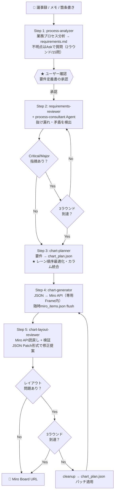

# Swimlane Chart Pipeline - Skill/Agent 作成計画 v2

## 概要

お客様ヒアリング情報（議事録・メモ・業務シナリオ）から、Miro上のスイムレーンチャートを自動生成するパイプラインを構築する。Claude Code の skill / agent として実装し、`/swimlane-pipeline` コマンド一つで全工程を実行可能にする。

**想定規模:** 中〜大（lane 8-15, column 10-20, node 40-100）

---

## パイプライン全体像



### Step 5 の責務明確化

Step 5 は**単独Skillを作らない**。swimlane-pipeline skill 内で chart-layout-reviewer agent を呼び出す形とする。理由: Step 5はStep 3-4と一体のループであり、単独で実行する意味がないため。

### ユーザー確認ポイント（重要ポイントのみ停止）

| タイミング | 条件 | 停止 |
|---|---|---|
| Step 1 完了後 | 常に | ✅ 要件定義書の確認 |
| Step 2 修正時 | Critical/Major指摘時 | ✅ 差分パッチの承認 |
| Step 2 修正時 | Minor/Info指摘時 | ❌ 自動適用 |
| Step 3 完了後 | — | ❌ 自動進行 |
| Step 4 完了後 | — | ❌ 自動進行 |
| Step 5 問題検出時 | レイアウト問題あり | ✅ 修正パッチの承認 |
| 完了時 | 常に | ✅ 最終URL提示 |

---

## 作成物一覧

### Skills (5つ)

| Skill名 | 目的 | Step |
|---|---|---|
| process-analyzer | 非構造テキスト → 業務要件定義書(markdown) | 1 |
| requirements-reviewer | 要件定義書のレビューループ制御 | 2 |
| chart-planner | 要件定義書 → チャート計画JSON | 3 |
| chart-generator | チャート計画JSON → Miro上にチャート生成 | 4 |
| swimlane-pipeline | 全ステップ統合 + Step5レビューループ | 全体 |

### Agents (3つ)

| Agent名 | 目的 | 呼出元 |
|---|---|---|
| process-consultant | 要件定義書の抜け漏れ・矛盾レビュー | requirements-reviewer skill (Step 2) |
| chart-layout-reviewer | チャートの視覚品質レビュー | swimlane-pipeline skill内 (Step 5) |
| process-analyst | 非構造テキストからのプロセス抽出 | process-analyzer skill (Step 1) |

### Pythonモジュール

| ファイル | 目的 |
|---|---|
| src/swimlane_lib.py | 既存swimlane_chart.pyから抽出したコアライブラリ |
| src/chart_plan_loader.py | chart_plan.json読み込み＋バリデーション |
| scripts/generate_chart.py | JSON → Miro チャート生成（専用Frame内、随時flush） |
| scripts/cleanup_chart.py | run_idスコープ内のアイテム一括削除 |
| scripts/validate_chart.py | run_idスコープ内のMiro API読戻し＋ヒューリスティック検証 |

---

## 安全設計: run_id とスコープ管理

### run_id の導入

全ての生成物を run_id（UUID v4）で追跡する。

```
output/
├── {run_id}/
│   ├── requirements.md
│   ├── chart_plan.json
│   ├── miro_items.json      ← 随時flush（部分失敗時もIDが残る）
│   └── validation_report.json
```

### Miro上のスコープ: 専用Frame

- 各run_idごとにMiroボード上に**専用Frame**を作成
- Frame名: `[swimlane] {title} ({run_id短縮})`
- 全ノード・コネクタはこのFrame内に配置
- cleanup時はFrame内のアイテムのみ削除（他のボードコンテンツに影響しない）
- readback/validate時もFrame内のアイテムのみ対象

### miro_items.json の随時flush

```json
{
  "run_id": "a1b2c3d4-...",
  "board_id": "uXjVGHJn7Xs=",
  "frame_id": "miro_item_xxx",
  "created_at": "2026-02-01T22:00:00+09:00",
  "items": [
    {"key": "START", "miro_id": "abc123", "type": "shape", "batch": 1},
    {"key": "SF_INPUT", "miro_id": "def456", "type": "shape", "batch": 1}
  ],
  "connectors": [
    {"src": "START", "dst": "SF_INPUT", "miro_id": "ghi789"}
  ],
  "status": "in_progress"
}
```

各バッチ送信成功時に即座にファイル書き込み。部分失敗時でも作成済みIDが保持される。

---

## 修正の安全設計: パッチ方式

### Step 2 (要件レビュー) の修正フロー

レビューで指摘された修正は**差分パッチとして提案**し、ユーザー承認後に反映する。

```
process-consultant agent → 指摘事項リスト
  ├── Critical/Major → 差分パッチ生成 → ユーザーに提示 → 承認後に適用
  └── Minor/Info → 自動適用（事実の書き換えではなく、記載追加・明確化のみ）
```

### Step 5 (レイアウト修正) のパッチ形式

chart_plan.json への修正は **JSON Patch風** の機械適用可能な形式で記述する。

```json
{
  "review_round": 1,
  "findings": [
    {
      "severity": "Major",
      "description": "SF_INPUTとSLACK_DONEが重なっている",
      "patch": [
        {"op": "replace", "path": "/nodes/1/dx", "value": 80},
        {"op": "replace", "path": "/layout/col_width", "value": 400}
      ]
    }
  ]
}
```

chart-layout-reviewer agentはこの形式で出力し、validate_chart.pyがパッチを自動適用する。

---

## Step 1 の終了条件

process-analyzer skillの質問ループに明確な打ち切り条件を設ける。

| 条件 | 値 | 処理 |
|---|---|---|
| 最大ラウンド数 | 2ラウンド | 打ち切り |
| 最大質問数 | 15問（累計） | 打ち切り |
| 全疑問解消 | — | 正常終了 |

**打ち切り時の処理:** 未確認事項は要件定義書の「前提・未確認事項」セクションに `(Assumption)` タグ付きで記録し、後続ステップに引き継ぐ。

---

## Chart Plan JSON スキーマ v2

### 変更点（v1からの差分）

- `schema_version` フィールド追加（将来互換性）
- `run_id` フィールド追加（トレーサビリティ）
- `columns` のセマンティクスを「工程フェーズ」として定義（日付限定ではない）

```json
{
  "schema_version": "1.0",
  "run_id": "a1b2c3d4-e5f6-7890-abcd-ef1234567890",
  "title": "月次売上報告フロー",
  "subtitle": "月次（毎月末締め、翌月5営業日目報告）",
  "lanes": ["各営業拠点", "営業企画部", "経理部", "経営企画部", "経営企画部長"],
  "columns": ["売上締め", "集計・確認", "差異分析", "修正・再確認", "承認", "報告"],
  "layout": {
    "lane_height": 200,
    "col_width": 420,
    "left_label_width": 260,
    "header_height": 80,
    "frame_padding": 200,
    "task_w": 160,
    "task_h": 80,
    "decision_w": 110,
    "decision_h": 110,
    "chip_w": 130,
    "chip_h": 28
  },
  "nodes": [
    {
      "key": "START",
      "label": "開始",
      "lane": "各営業拠点",
      "col": 0,
      "kind": "start",
      "dx": -260,
      "dy": 0,
      "fill": "#BFE9D6"
    },
    {
      "key": "DEC_DIFF",
      "label": "差異\nある？",
      "lane": "経営企画部",
      "col": 2,
      "kind": "decision",
      "dx": 0,
      "dy": 0
    }
  ],
  "edges": [
    {"src": "START", "dst": "SF_INPUT"},
    {"src": "DEC_DIFF", "dst": "FIX", "label": "Yes", "color": "#2E7D32"},
    {"src": "FIX", "dst": "RECON", "dashed": true, "color": "#C62828", "shape": "curved"}
  ]
}
```

**columns の意味:** 「工程フェーズ」として定義。日付・時刻は各カラムのラベルに含めてよいが、逆流エッジ（差戻し・ループ）も自然に表現可能な粒度とする。

---

## Miro API 運用仕様

### リトライ・レート制限

| 項目 | 仕様 |
|---|---|
| レート制限 | 100,000 credits/min, Level 1 = 50 credits/call |
| バルク上限 | 20 items/batch |
| リトライ戦略 | 指数バックオフ (1s, 2s, 4s, 8s, 最大16s) |
| 最大リトライ回数 | 3回/リクエスト |
| 429応答時 | Retry-Afterヘッダを尊重、なければ指数バックオフ |
| 部分失敗 | バルク作成は全件or0件（トランザクショナル）→ バッチ単位でリトライ |
| miro_items.json flush | バッチ成功ごとに即座書き込み |

### ボード運用モード: 専用Frame新規生成

- 既存ボードコンテンツには一切触れない
- 各実行(run)で新規Frameを作成し、その中に全アイテムを配置
- Frameの位置: 既存コンテンツの右側に自動配置（既存Frame検出→右端+余白）
- 再実行時: 旧Frameを削除して新Frameを作成（cleanup経由）

### 削除（cleanup）の安全策

1. miro_items.json の run_id + frame_id で対象を特定
2. **Frame 存在チェック**: Frame が既に削除済みなら即完了（全アイテムも消去済みと判断）
3. Frame内のアイテムのみ削除対象
4. 削除前にアイテム数の照合（JSONの件数 vs API readbackの件数）
5. 不一致時は警告を出してユーザー確認を求める
6. 削除はコネクタ → シェイプ → テキスト → Frame の順序（依存関係順）
7. **404 は正常扱い**: 削除済みアイテムへの DELETE は 404 で即 return（リトライしない）

---

## ファイル構造

```
swimlane-chart/
├── .claude/
│   ├── skills/
│   │   ├── process-analyzer/
│   │   │   ├── SKILL.md
│   │   │   └── references/
│   │   │       ├── process_analysis_checklist.md
│   │   │       └── question_patterns.md
│   │   ├── requirements-reviewer/
│   │   │   ├── SKILL.md
│   │   │   └── references/
│   │   │       ├── review_criteria.md
│   │   │       └── common_gaps.md
│   │   ├── chart-planner/
│   │   │   ├── SKILL.md
│   │   │   ├── references/
│   │   │   │   ├── layout_heuristics.md
│   │   │   │   ├── node_kind_guide.md
│   │   │   │   └── color_palette.md
│   │   │   └── assets/
│   │   │       └── chart_plan_schema.json
│   │   ├── chart-generator/
│   │   │   ├── SKILL.md
│   │   │   └── references/
│   │   │       └── miro_api_constraints.md
│   │   └── swimlane-pipeline/
│   │       ├── SKILL.md
│   │       └── references/
│   │           └── pipeline_workflow.md
│   └── agents/
│       ├── process-consultant.md
│       ├── chart-layout-reviewer.md
│       └── process-analyst.md
├── src/
│   ├── __init__.py
│   ├── swimlane_lib.py            ← 既存コアロジック抽出
│   └── chart_plan_loader.py       ← JSON読込+バリデーション
├── scripts/
│   ├── generate_chart.py          ← JSON → Miro (Frame内、随時flush)
│   ├── cleanup_chart.py           ← run_idスコープ削除
│   └── validate_chart.py          ← run_idスコープ読戻し+検証
├── output/                        ← .gitignore対象
│   └── {run_id}/                  ← run単位のディレクトリ
│       ├── requirements.md
│       ├── chart_plan.json
│       ├── miro_items.json
│       └── validation_report.json
├── examples/
│   └── monthly_report_flow.json   ← 既存ハードコードのJSON化
├── scripts/swimlane_chart_demo.py  ← ハードコードされたデモスクリプト
├── docs/
│   ├── pipeline-design.md
│   ├── miro-chart-architecture.md
│   └── setup-guide.md
├── .env
├── .gitignore
└── requirements.txt
```

---

## 各Skill 詳細設計

### Skill 1: process-analyzer

**入力:** ユーザーが貼り付けた議事録・メモ・業務シナリオテキスト

**処理フロー:**

1. テキストを読み込み、以下を抽出:
   - 関連部門・役職（スイムレーン候補）
   - 業務プロセスステップとその時系列
   - 判断ポイント（分岐条件・Yes/No先）
   - 使用システム・ツール
   - 各ステップの入力/出力
   - 例外・エラーパス
2. AskUserQuestion で不明点を質問（終了条件: 2ラウンドまたは累計15問）
3. 未確認事項は `(Assumption)` タグ付きで「前提・未確認事項」セクションに記録
4. `output/{run_id}/requirements.md` を生成

**出力フォーマット:**

```markdown
# 業務プロセス要件定義書: [プロセス名]

## 概要
- プロセス名 / 目的 / 頻度 / トリガー

## 関連部門・役職（スイムレーン候補）
1. [部門A] - [役割説明]

## プロセスステップ
### Step N: [ステップ名]
- **担当部門**: ...
- **工程フェーズ**: ... (columnsの候補)
- **処理内容**: ...
- **使用システム**: ...
- **入力**: ... / **出力**: ...
- **判断ポイント**: [条件] → Yes: [先] / No: [先]

## 判断ロジック一覧
## 例外・エラーパス
## 前提・未確認事項
- (Assumption) [未確認の前提事項...]
## ヒアリングで確認済みの事項
```

### Skill 2: requirements-reviewer

**処理フロー:**

1. `output/{run_id}/requirements.md` を読み込む
2. process-consultant エージェントに送付してレビューを依頼
3. レビュー結果を受領（Critical/Major/Minor/Info）
4. 修正方針:
   - **Critical/Major:** 差分パッチを生成 → ユーザーに提示 → 承認後に適用
   - **Minor/Info:** 自動適用（記載追加・明確化のみ。事実の書き換えは行わない）
5. 修正後、再度エージェントに送付（最大3ラウンド）
6. 3ラウンド後にCriticalが残っている場合: ユーザーにエスカレーション

### Skill 3: chart-planner

**入力:** `output/{run_id}/requirements.md`（レビュー済み）

**処理フロー:**

1. 部門一覧 → `lanes` 配列
2. **レーン順序の最適化**: 隣接性原則（接続の多いレーン同士を隣接）、分岐近接原則（decision の分岐先を隣接）、空レーン回避
3. 工程フェーズ → `columns` 配列 (日付限定ではなくフェーズとして定義)
4. **カラムの統合検討**: decision と直前タスクの同一カラム配置、空カラム排除、目標 ≤7 カラム
5. 各プロセスステップ → `nodes` 配列 (key, label, lane, col, kind)
6. 同一セル内の複数ノード → dx/dy オフセット計算（layout_heuristics.md に従う、2ノードは ±100、3ノードは -160/0/+160）
7. プロセス間の接続 → `edges` 配列（逆流エッジも含む）
8. システムラベル → chip ノード
9. レイアウトパラメータの自動調整（レーン数・カラム数に応じてサイズ計算）
10. `schema_version` と `run_id` をセット
11. バリデーション: 全edgeのsrc/dstが存在するか、全nodeのlaneがlanesに存在するか、decision の分岐先レーンが隣接しているか、カラム数 ≤7 か

**出力:** `output/{run_id}/chart_plan.json`

### Skill 4: chart-generator

**入力:** `output/{run_id}/chart_plan.json`

**処理フロー:**

1. `scripts/generate_chart.py` を実行
2. `chart_plan.json` を読み込み → Node/Edge/Layout dataclassに変換
3. 専用Frameを作成（既存コンテンツの右側に配置）
4. Frame内に全アイテムをバルク作成（20件/バッチ、指数バックオフ付きリトライ）
5. バッチ成功ごとに `output/{run_id}/miro_items.json` へflush
6. コネクタを作成（1件ずつ、IDマッピング使用）
7. エラー時は `scripts/cleanup_chart.py` でrun_idスコープ内を削除してリトライ

### Skill 5: swimlane-pipeline (マスターオーケストレーター)

`/swimlane-pipeline` コマンドで実行。run_idを生成し、全ステップを順次実行。

**Step 5 (レビュー) の具体的処理 (pipeline内で直接実行):**

1. `scripts/validate_chart.py` を実行してMiro API読戻し + ヒューリスティック検証
2. 検証結果と `chart_plan.json` を chart-layout-reviewer agent に送付
3. agent が JSON Patch形式で修正指示を返却
4. 修正あり → ユーザーに提示 → 承認後にパッチ適用 → cleanup → Step 3から再実行
5. 最大3ラウンド。3ラウンド後に問題残存 → 現状のまま結果提示（ユーザー判断）

---

## Agent 詳細設計

### Agent: process-consultant

```yaml
name: process-consultant
description: 業務プロセス要件定義書のレビュー。抜け漏れ・矛盾・スイムレーンチャート化可否を判定。
model: sonnet
```

- **ペルソナ:** 業務プロセス改善15年のシニアコンサルタント
- **判断基準:** 「この要件定義書だけで、迷いなくスイムレーンチャートを描けるか？」
- **レビュー観点:**
  1. 全ての関連部門が特定されているか
  2. 部門間のハンドオフが明示されているか
  3. 全判断ポイントの両分岐が記載されているか
  4. 工程フェーズがカラム割当可能な粒度か
  5. 使用システム・ツールが特定されているか
  6. 例外パスが文書化されているか
  7. `(Assumption)` タグ付きの前提に明らかな誤りがないか
- **出力:** 指摘事項リスト (Critical / Major / Minor / Info) + 修正差分パッチ

### Agent: chart-layout-reviewer

```yaml
name: chart-layout-reviewer
description: スイムレーンチャートの視覚品質レビュー。Miro API読戻しデータに基づきJSON Patch形式で修正指示を出力。
model: sonnet
```

- **ペルソナ:** 情報デザインの専門家
- **入力:** `chart_plan.json` + `validate_chart.py` の検証結果
- **レビュー観点:**
  1. ノード間の重なり（バウンディングボックス交差）
  2. コネクタの欠落・断絶
  3. コネクタの交差（レーン並び替えで解消可能か）
  4. ラベルの切れ（テキスト長 vs ノードサイズ。日本語は~16px/文字で概算）
  5. レーン間のバランス（空レーン、過密レーン）
  6. カラム使用効率（空カラムの排除、統合可能なカラム）
  7. 色の一貫性
  8. 判断ダイヤモンドのラベル収まり（110×110 で有効表示幅 ~70px）
  9. 逆流エッジの視認性
  10. end ノードの配置（最終フローの到達レーン・カラムに配置）
- **修正パッチ対応パス:** `/nodes/{index}/dx`, `/nodes/{index}/dy`, `/nodes/{index}/lane`, `/nodes/{index}/col`, `/lanes`, `/columns`, `/layout/col_width`, `/layout/task_w`, `/layout/decision_w`, `/layout/decision_h`, `/layout/chip_w`
- **出力:** JSON Patch形式の修正指示

```json
{
  "review_round": 1,
  "findings": [
    {
      "severity": "Major",
      "description": "SF_INPUTとSLACK_DONEが重なっている",
      "patch": [
        {"op": "replace", "path": "/nodes/1/dx", "value": 80}
      ]
    }
  ],
  "summary": "2件のMajor, 1件のMinor"
}
```

### Agent: process-analyst

```yaml
name: process-analyst
description: 非構造テキストから業務プロセス要素を抽出する専門家。
model: opus
```

- **ペルソナ:** 業務プロセス分析の専門家
- **用途:** process-analyzer skill 内で、テキストからプロセス要素を抽出する際に使用

---

## コード変更計画

### 1. swimlane_chart.py のリファクタリング → src/swimlane_lib.py

**抽出対象 (swimlane_chart.py の主要コンポーネント):**

- `Node`, `Edge`, `Layout` dataclass 定義
- `MiroClient` クラス（指数バックオフリトライ追加）
- `lane_center_y()`, `col_center_x()`, `node_xy()` 座標計算関数
- `shape_payload()`, `text_payload()`, `connector_payload()` ペイロード生成関数
- 背景レイヤー構築関数群（Frame作成機能追加）

**新規追加機能:**

- `create_frame(client, title, x, y, w, h)` → Frame作成
- `find_rightmost_frame(client)` → 既存Frameの右端座標取得
- `cleanup_by_run(client, miro_items_path)` → run_idスコープ削除
- `readback_frame_items(client, frame_id)` → Frame内アイテム読戻し
- 指数バックオフ付きリトライ (`@retry(max=3, backoff=[1,2,4])`)

### 2. src/chart_plan_loader.py (新規)

- `load_chart_plan(json_path)` -> `ChartPlan` (NamedTuple)
- `schema_version` 互換性チェック
- JSON Schema バリデーション
- Node/Edge/Layout dataclass へのマッピング
- `apply_patch(chart_plan_path, patches)` → JSON Patchの適用

### 3. スクリプト

| スクリプト | CLI | 説明 |
|---|---|---|
| scripts/generate_chart.py | `python scripts/generate_chart.py output/{run_id}/chart_plan.json` | JSON → Miro (Frame内、随時flush) |
| scripts/cleanup_chart.py | `python scripts/cleanup_chart.py output/{run_id}/miro_items.json` | run_idスコープ削除 |
| scripts/validate_chart.py | `python scripts/validate_chart.py output/{run_id}/miro_items.json` | 読戻し+重なり検出+接続検証 |

### 4. swimlane_chart.py (元ファイル)

- `from src.swimlane_lib import *` でインポートに変更
- ハードコードデータはそのまま維持（後方互換）
- 動作は一切変わらない

---

## 実装順序

### Phase 1: 基盤整備 (コードリファクタリング) ✅ 完了

1. `src/` ディレクトリ作成、`swimlane_lib.py` に共通ロジック抽出
2. `src/chart_plan_loader.py` 作成 (JSON → dataclass変換 + バリデーション)
3. `scripts/generate_chart.py` 作成 (Frame生成、随時flush対応)
4. `examples/monthly_report_flow.json` 作成（既存ハードコードデータのJSON化、schema_version付き）
5. `swimlane_chart.py` をインポート方式に変更
6. 検証: JSONからの生成が元のスクリプトと同一結果になることを確認

### Phase 2: ユーティリティスクリプト ✅ 完了

7. `scripts/cleanup_chart.py` 作成（run_idスコープ、削除順序制御、404正常扱い）
8. `scripts/validate_chart.py` 作成（重なり検出、接続検証、ラベル切れ検出）
9. 検証: 生成 → 読戻し → 検証 → 削除のサイクル動作確認

### Phase 3: Agent定義作成 ✅ 完了

10. `.claude/agents/process-consultant.md`
11. `.claude/agents/chart-layout-reviewer.md` (JSON Patch出力形式、コネクタ交差・カラム効率・endノード配置レビュー)
12. `.claude/agents/process-analyst.md`

### Phase 4: Skill作成（下流 → 上流の順） ✅ 完了

13. chart-generator skill + references (miro_api_constraints.md: Frame内座標・parent注入)
14. chart-planner skill + references (layout_heuristics.md: レーン順序最適化・カラム統合, node_kind_guide.md: 更新済みサイズ, color_palette.md) + schema
15. requirements-reviewer skill + references (review_criteria.md, common_gaps.md)
16. process-analyzer skill + references (process_analysis_checklist.md, question_patterns.md)

### Phase 5: マスターオーケストレーター + 統合テスト ✅ 完了

17. swimlane-pipeline skill 作成 (Step 5レビューループ含む)
18. E2Eテスト: インボイス自動処理フロー（7レーン・7カラム・23ノード・23コネクタ・3分岐判定）で全ステップ通しテスト完了

---

## 検証方法

### Phase 1 検証

```bash
# デモスクリプト実行
python scripts/swimlane_chart_demo.py
# JSON版で同一結果
python scripts/generate_chart.py examples/monthly_report_flow.json
```

### Phase 2 検証

```bash
python scripts/validate_chart.py output/{run_id}/miro_items.json
python scripts/cleanup_chart.py output/{run_id}/miro_items.json
```

### Phase 5 検証

```bash
# 個別Skill動作確認
/process-analyzer    ← テキスト入力 → requirements.md 生成確認
/requirements-reviewer ← レビューループ動作確認
/chart-planner       ← requirements.md → chart_plan.json 確認
/chart-generator     ← chart_plan.json → Miroチャート確認

# 統合テスト
/swimlane-pipeline   ← 全工程一気通貫テスト
```

---

## 主要リスクと対策

| リスク | 対策 |
|---|---|
| dx/dy計算の精度 | layout_heuristics.mdにルールを詳細に記載。同一セル内2ノードはdx±100、3ノードは-160/0/+160 |
| 日本語ラベル幅の見積り | ~16px/文字で概算。decision(110×110)は有効幅~70px=4文字/行。validate_chart.pyで切れ検出 |
| コネクタ交差 | レーン順序最適化（隣接性原則・分岐近接原則）で交差を最小化 |
| Miro APIバルク削除なし | コネクタ→シェイプ→テキスト→Frame順の逐次削除（下記「削除順序」参照）。404は正常扱い（既削除）で即return |
| cleanup時のハング | Frame存在チェックで早期終了。delete_item/delete_connectorに404ハンドリング追加 |
| コネクタ経路の制御不能 | 3レーン以上跨ぐエッジは透明アンカーノード中継を検討 |
| Frame内座標系 | 全アイテムにparentプロパティでFrame IDを注入。Miro APIのデフォルト座標系（Frame中心原点）で配置 |
| パイプライン中断時の回復 | miro_items.json随時flush + run_idスコープでcleanup可能 |
| LLMによる事実書換リスク | Critical/Major修正はユーザー承認必須。自動適用はMinor/Infoの追記のみ |
| **Miro API SPOF** | パイプライン全体がMiro REST API v2に依存。API障害時はリトライ（指数バックオフ最大3回）で自動回復を試みるが、長時間障害時は中間成果物（chart_plan.json）を保持し、復旧後に Step 4 から再実行可能。オフライン代替手段なし |

### 削除順序の技術的根拠

cleanup 時の削除は以下の順序で実行する:

1. **コネクタ** → 2. **シェイプ/テキスト** → 3. **Frame**

この順序の理由:
- **コネクタは startItem/endItem への参照を保持**しているため、先にシェイプを削除するとコネクタが孤立参照を持つ状態になる。Miro API はこの状態でも 200 を返すが、一部のクライアント操作で不整合が生じる可能性がある
- **Frame を削除すると内部アイテムも連鎖削除される**が、コネクタは Frame 外のエンティティであるため残存する。Frame を先に削除すると、コネクタのクリーンアップに必要な情報（どのコネクタがこの run に属するか）の特定がコネクタ一覧の全件走査に依存してしまう
- コネクタを先に削除することで、参照整合性を保ちつつ、各アイテムの削除が独立して安全に行える
